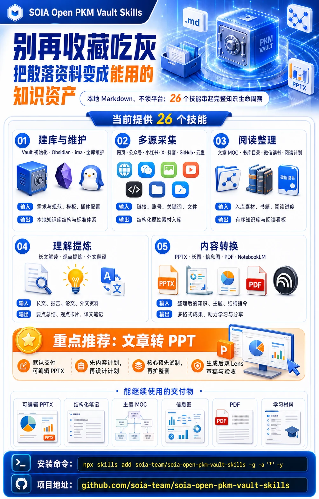
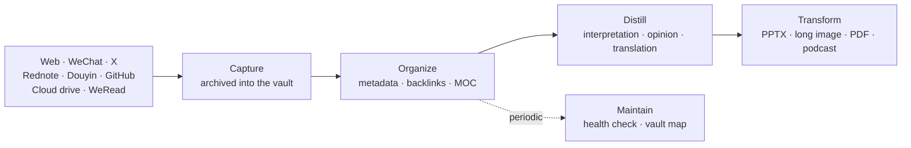

<div align="center">



# SOIA Open PKM Vault Skills

**Stop hoarding links you never reopen — turn scattered material into usable knowledge**

Local Markdown, no platform lock-in; 26 skills covering the full knowledge lifecycle

[中文](README.md) · English · [Ecosystem portal](https://github.com/soia-team/soia-open-skills)

</div>

---

## What it solves

The more diligently you save, the faster it gathers dust. What's missing is not another bookmark folder — it's **a pipeline from material coming in to something usable coming out**.



## 26 skills

### 01 Build and maintain　`Requirements and conventions → local vault structure`

| Skill | Responsibility | Ready |
|---|---|:-:|
| `soia-pkm-bootstrap-vault-base` | Initializes a neutral Markdown vault skeleton and the PKM loop | ✅ |
| `soia-pkm-bootstrap-vault-obsidian` | Configures an existing vault as an Obsidian consumer | ✅ |
| `soia-pkm-bootstrap-vault-ima` | Connects an existing vault to Tencent ima | 🟡 |
| `soia-pkm-maintain` | Health checks, whole-vault map and AI session logs | ✅ |

### 02 Multi-source capture　`Links · accounts · files → structured material in the vault`

| Skill | Responsibility | Ready |
|---|---|:-:|
| `soia-pkm-clip-web` | Archives a web page or blog article | ✅ |
| `soia-pkm-clip-wechat-article` | Archives a single WeChat Official Account article | ✅ |
| `soia-pkm-clip-wechat-account` | Bulk-archives published articles from your own account | 🟡 |
| `soia-pkm-clip-x` | Archives an X post, thread or Article | 🟡 |
| `soia-pkm-clip-rednote` | Archives a Rednote text or video note | ✅ |
| `soia-pkm-clip-douyin` | Archives a Douyin video and keeps a local media index | ✅ |
| `soia-pkm-clip-github-repo` | Archives a GitHub repo as a project card and research note | ✅ |
| `soia-pkm-clip-drive` | Bulk-imports existing PDFs and Word files from cloud or local storage | ✅ |
| `soia-pkm-alipan-curator` | Plans and organizes Alipan resources into a reviewable catalog index | 🟡 |
| `soia-pkm-alipan-drive-ops` | Alipan login, browsing and file operations | 🟡 |
| `soia-pkm-baidu-netdisk-ops` | Baidu Netdisk atomic operations and read-only scanning | 🟡 |

### 03 Reading and organization　`Material · books · progress → an ordered vault and reading board`

| Skill | Responsibility | Ready |
|---|---|:-:|
| `soia-pkm-organize-article-moc` | Metadata normalization, topic backlinks and two-level MOCs | ✅ |
| `soia-pkm-library-book-catalog` | Maintains the book catalog and reading records, purely locally | ✅ |
| `soia-pkm-library-weread-sync` | Syncs WeRead finished books and highlights | 🟡 |
| `soia-pkm-reading-plan` | Turns a book list or topic into a word-count-paced reading plan | ✅ |

### 04 Understanding and distillation　`Long reads · papers · foreign text → summaries, opinions, translations`

| Skill | Responsibility | Ready |
|---|---|:-:|
| `soia-pkm-interpret-article-analysis` | Produces a standalone AI interpretation so you can judge whether to read closely | ✅ |
| `soia-pkm-distill-article-opinion` | Socratic questioning until *you* articulate your own take | ✅ |
| `soia-pkm-translate-article-zh` | Three-tier translation of foreign articles; never overwrites the original | ✅ |

### 05 Transformation　`Organized knowledge → PPTX · long image · PDF · study material`

| Skill | Responsibility | Ready |
|---|---|:-:|
| `soia-pkm-transform-article-ppt` | Turns an article into a media package with an editable PPTX as the master | ✅ |
| `soia-pkm-transform-article-visual` | Turns an article into long images, infographics, posters and covers | ✅ |
| `soia-pkm-transform-obsidian-pdf` | Exports vault notes to PDF via Obsidian's native export | ✅ |
| `soia-pkm-transform-article-notebooklm` | Turns an article into quizzes, flashcards and podcasts via NotebookLM | 🟡 |

✅ Works right after install　🟡 Needs a platform login or API key first; the skill tells you what is missing before it runs

## Install

Any of three hosts. Installing the domain plugin brings all 26 skills at once.

```bash
claude plugin marketplace add soia-team/soia-open-skills && claude plugin install soia-pkm-vault@soia
```

```bash
codex plugin marketplace add soia-team/soia-open-skills && codex plugin add soia-pkm-vault@soia
```

WorkBuddy is a desktop app with no CLI, so a skill does the work — tell your agent "install into WorkBuddy", or run:

```bash
python3 <soia-open-skills>/skills/soia-meta-skill-release/scripts/install_workbuddy_experts.py soia-pkm-vault
```

Restart the client, then summon **Soia · 知识库管家** under Experts → My Experts.

> **Always-on cost ~2.8k tok**. `claude plugin disable soia-pkm-vault@soia` drops it to zero; enable it again on a writing day.
> For a single skill use npx: `npx skills add soia-team/soia-open-pkm-vault-skills -g -a '*' -s <skill-name> -y` — pick one route or the other; running both puts the same skill in the index twice and the copies drift apart.

## What it does not do

- **Does not host your vault.** Everything stays in your own local directory; this repo only provides the skills that operate on it.
- **Does not write your opinions.** Interpretation produces material for you to judge; opinion distillation asks questions until you say it yourself.
- **Does not store credentials.** WeRead, X and Alipan sessions stay in their official flows — never in the repo, the vault body, or the logs.
- **Does not install environments.** Obsidian, Playwright and similar prerequisites belong to [soia-open-env-skills](https://github.com/soia-team/soia-open-env-skills).

## Contributing

Before committing a skill change:

```bash
python3 -m unittest discover -s tests -p 'test_*.py' && python3 scripts/audit_skills.py --strict && python3 scripts/generate_expert_manifest.py --check
```

Full workflow in the portal's [CONTRIBUTING.md](https://github.com/soia-team/soia-open-skills/blob/main/CONTRIBUTING.md).

## License

MIT — see [LICENSE](./LICENSE).
