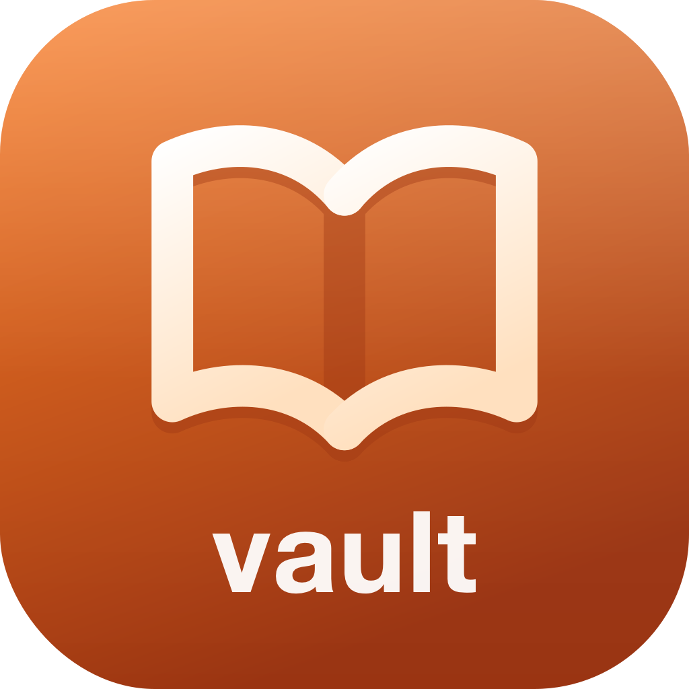
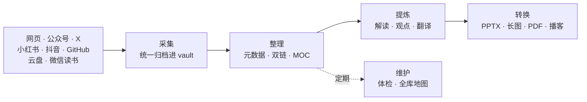

<div align="center">



# SOIA Open PKM Vault Skills

**别再收藏吃灰——把散落资料变成能用的知识资产**

本地 Markdown，不锁平台；26 个技能串起完整知识生命周期

[English](README.en.md) · 中文 · [全生态门户](https://github.com/soia-team/soia-open-skills)

</div>

---

## 它解决什么

收藏得越勤，吃灰得越快。真正缺的不是另一个收藏夹，而是**一条从资料进入到成果输出的流水线**。



## 26 个技能

### 01 建库与维护　`需求与规范 → 本地知识库结构与标准体系`

| 技能 | 职责 | 开箱 |
|---|---|:-:|
| `soia-pkm-bootstrap-vault-base` | 初始化中立 Markdown vault 骨架与 PKM 闭环 | ✅ |
| `soia-pkm-bootstrap-vault-obsidian` | 把已有 vault 配成 Obsidian 消费端 | ✅ |
| `soia-pkm-bootstrap-vault-ima` | 把已有 vault 接入腾讯 ima | 🟡 |
| `soia-pkm-maintain` | 健康体检、全库地图与 AI 会话日志 | ✅ |

### 02 多源采集　`链接 · 账号 · 文件 → 结构化原始素材入库`

| 技能 | 职责 | 开箱 |
|---|---|:-:|
| `soia-pkm-clip-web` | 归档网页或博客文章 | ✅ |
| `soia-pkm-clip-wechat-article` | 归档单篇公众号文章 | ✅ |
| `soia-pkm-clip-wechat-account` | 批量归档自己公众号的已发文章 | 🟡 |
| `soia-pkm-clip-x` | 归档 X 推文、thread 或 Article | 🟡 |
| `soia-pkm-clip-rednote` | 归档小红书图文或视频笔记 | ✅ |
| `soia-pkm-clip-douyin` | 归档抖音视频并保留媒体索引 | ✅ |
| `soia-pkm-clip-github-repo` | 把 GitHub 仓库归档为项目卡与调研笔记 | ✅ |
| `soia-pkm-clip-drive` | 批量导入云盘或本地的 PDF / Word 存量资料 | ✅ |
| `soia-pkm-alipan-curator` | 规划整理阿里云盘资源，产出馆藏索引 | 🟡 |
| `soia-pkm-alipan-drive-ops` | 阿里云盘登录、浏览与文件操作 | 🟡 |
| `soia-pkm-baidu-netdisk-ops` | 百度网盘原子操作与只读扫描 | 🟡 |

### 03 阅读整理　`入库素材 · 书籍 · 阅读进度 → 有序知识库与阅读看板`

| 技能 | 职责 | 开箱 |
|---|---|:-:|
| `soia-pkm-organize-article-moc` | 元数据规范化、主题双链与两级 MOC | ✅ |
| `soia-pkm-library-book-catalog` | 纯本地维护书库编目与阅读记录 | ✅ |
| `soia-pkm-library-weread-sync` | 同步微信读书已读书目与划线 | 🟡 |
| `soia-pkm-reading-plan` | 把书单或主题排成按字数的阅读计划 | ✅ |

### 04 理解提炼　`长文 · 论文 · 外文资料 → 要点总结 · 观点卡片 · 译文`

| 技能 | 职责 | 开箱 |
|---|---|:-:|
| `soia-pkm-interpret-article-analysis` | 为长文生成独立 AI 解读，帮你判断值不值得深挖 | ✅ |
| `soia-pkm-distill-article-opinion` | 苏格拉底式逐问，把你自己的观点问出来 | ✅ |
| `soia-pkm-translate-article-zh` | 外文文章三档翻译，不覆盖原文 | ✅ |

### 05 内容转换　`整理后的知识 → 可编辑 PPTX · 长图 · PDF · 学习材料`

| 技能 | 职责 | 开箱 |
|---|---|:-:|
| `soia-pkm-transform-article-ppt` | 转为以可编辑 PPTX 为母版的演示媒体包 | ✅ |
| `soia-pkm-transform-article-visual` | 转为长图、信息图、海报、封面 | ✅ |
| `soia-pkm-transform-obsidian-pdf` | 用 Obsidian 原生导出转 PDF | ✅ |
| `soia-pkm-transform-article-notebooklm` | 用 NotebookLM 转试卷、闪卡、播客 | 🟡 |

✅ 装完即用　🟡 需先完成平台登录或申请 API key，技能会在执行前告诉你缺什么

## 安装

三个宿主任选，装整个领域插件即 26 个技能一次到位。

```bash
claude plugin marketplace add soia-team/soia-open-skills && claude plugin install soia-pkm-vault@soia
```

```bash
codex plugin marketplace add soia-team/soia-open-skills && codex plugin add soia-pkm-vault@soia
```

WorkBuddy 是桌面端没有 CLI，由技能代劳——对 AI 说「装到 WorkBuddy」，或直接跑：

```bash
python3 <soia-open-skills>/skills/soia-meta-skill-release/scripts/install_workbuddy_experts.py soia-pkm-vault
```

装完重启客户端，在【专家中心 → 我的专家】召唤 **Soia · 知识库管家**。

> **常驻成本 ~2.8k tok**。不用时 `claude plugin disable soia-pkm-vault@soia` 降到零，随时开回来。
> 只想要单个技能可走 npx：`npx skills add soia-team/soia-open-pkm-vault-skills -g -a '*' -s <技能名> -y`——与插件二选一，并存会产生双份索引且各自漂移。

## 不负责什么

- **不托管你的知识库**。内容全在你自己的本地目录，本仓只提供操作技能。
- **不替你写观点**。解读输出的是「供你判断的材料」；观点提炼是逐问引导你说出来，不代笔。
- **不保存任何凭据**。微信读书、X、阿里云盘的登录态由各自官方流程持有，不进仓库、不进 vault 正文、不进日志。
- **不做环境安装**。Obsidian、Playwright 等依赖交给 [soia-open-env-skills](https://github.com/soia-team/soia-open-env-skills)。

## 贡献

改动技能后提交前跑：

```bash
python3 -m unittest discover -s tests -p 'test_*.py' && python3 scripts/audit_skills.py --strict && python3 scripts/generate_expert_manifest.py --check
```

完整流程见门户仓 [CONTRIBUTING.md](https://github.com/soia-team/soia-open-skills/blob/main/CONTRIBUTING.md)。

## License

MIT —— 见 [LICENSE](./LICENSE)。
